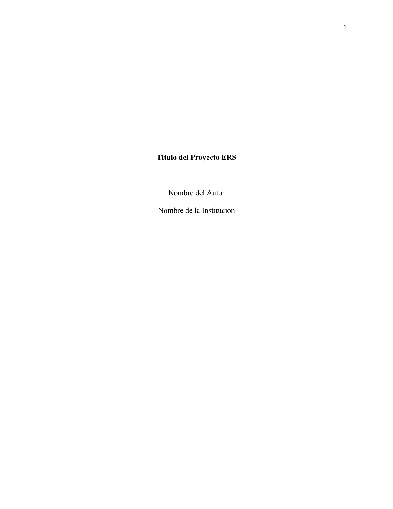
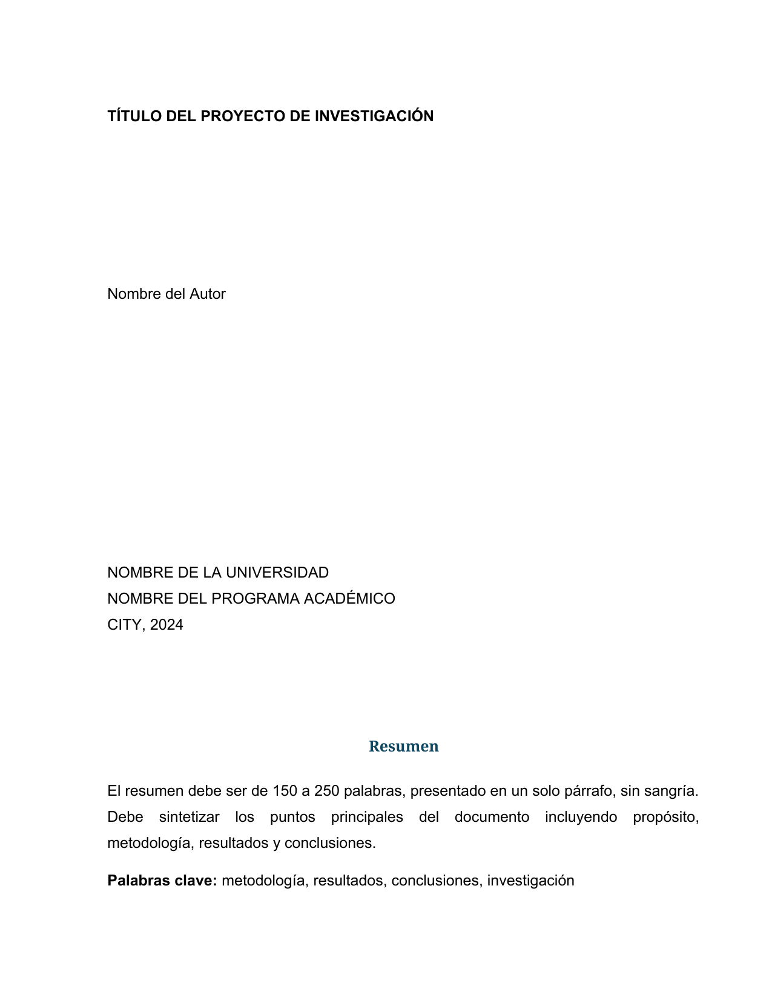
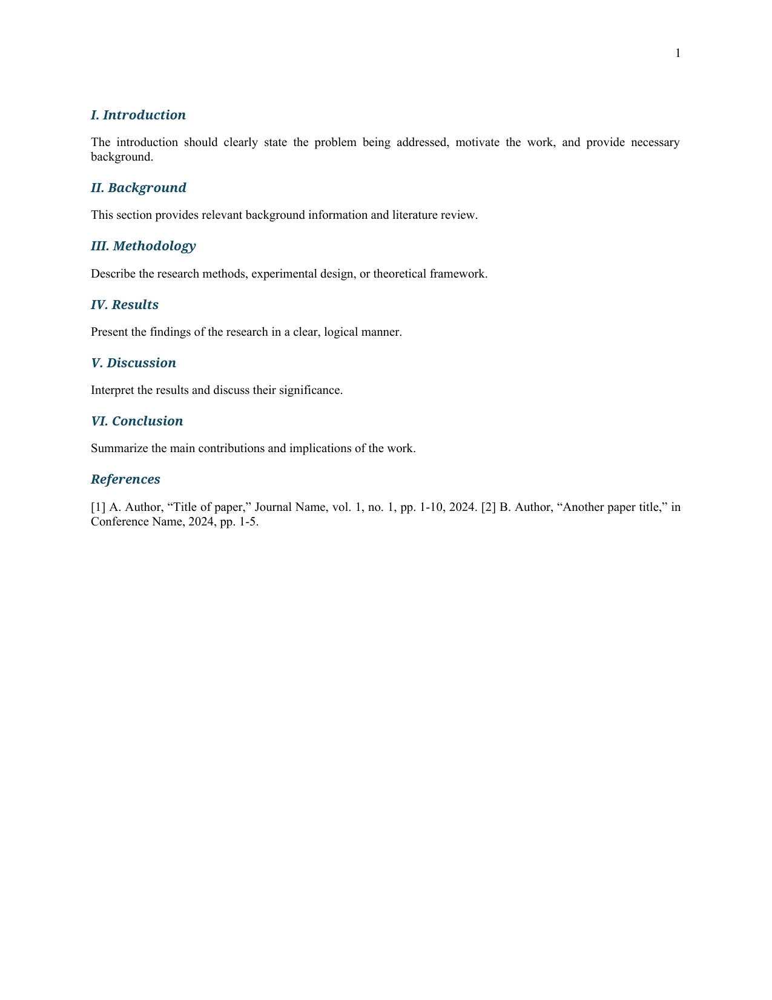

# NormaDocs

<!-- Badges -->
[](https://pypi.org/project/normadocs/)
[](https://www.python.org/)
[](https://github.com/CristianMz21/normadocs/actions/workflows/ci.yml)
[](https://opensource.org/licenses/MIT)
[](https://peps.python.org/pep-0561/)
[](https://github.com/astral-sh/ruff)
[](https://github.com/CristianMz21/normadocs/actions)
[](https://pypi.org/project/normadocs/)

**NormaDocs** converts Markdown documents to professionally formatted DOCX/PDF files with automatic compliance to major academic citation standards.

Write in Markdown. Output perfectly formatted documents.

---

## Why NormaDocs?

| Approach | Formatting | Bibliography | Automation |
|----------|:----------:|:------------:|:----------:|
| Manual Word editing | ❌ Error-prone | ❌ Manual | ❌ None |
| Generic converters | ❌ Not standards-compliant | ❌ Basic | ⚠️ Limited |
| **NormaDocs** | ✅ Exact standard compliance | ✅ BibTeX + CSL | ✅ Full pipeline |

**What you get:**
- Exact margins, fonts, and spacing per standard
- Automatic cover page from metadata
- Proper table formatting (APA, IEEE, ICONTEC rules)
- Bibliography with CSL style support
- PDF generation (LibreOffice or WeasyPrint)

---

## Features

- **3 Academic Standards**: APA 7th Edition, ICONTEC NTC 1486, IEEE 8th Edition
- **Automatic Cover Pages**: Extracts title, author, institution, program, faculty, and date from document metadata
- **Precise Formatting**: Margins, fonts (Times New Roman/Arial), line spacing per standard specification
- **Table Support**: Horizontal borders only (APA style), proper captions with "Table X" format
- **Bibliography**: BibTeX (`.bib`) files and CSL styles via Pandoc
- **Dual Output**: DOCX (always) + PDF (optional)
- **Two Interfaces**: CLI command or Python library import
- **Type-Safe**: Full type annotations with `py.typed` marker (PEP 561)
- **Quality Gates**: CI enforces linting, type checking, security scans, and 78%+ test coverage

---

## Supported Standards

| Standard | Font | Spacing | Use Case |
|----------|------|---------|----------|
| **APA 7th Edition** | Times New Roman 12pt | Double | Social Sciences, Psychology |
| **ICONTEC NTC 1486** | Arial 12pt | 1.5 lines | Colombian Academic |
| **IEEE 8th Edition** | Times New Roman 10pt | Single | Engineering, Technical |

---

## Example Output

Convert your Markdown to professionally formatted documents:

### APA 7th Edition


### ICONTEC NTC 1486


### IEEE 8th Edition


---

## Quick Start

### Minimal Example

**Input** (`document.md`):
```markdown
**My Research Paper**

Jane Doe
Computer Science
CS101
Tech University
Engineering
2026-04-10

# Abstract

This paper presents...

**Keywords:** markdown, academic, converter
```

**Command:**
```bash
normadocs document.md
```

**Output**: `document.docx` with APA-formatted cover page, double spacing, and proper margins.

---

## Installation

### Prerequisites

- **Python** 3.10 or higher
- **[Pandoc](https://pandoc.org/installing.html)** — required for Markdown to DOCX conversion

### From PyPI

```bash
pip install normadocs
```

### PDF Support (optional)

```bash
# Option 1: WeasyPrint
pip install normadocs[pdf]

# Option 2: LibreOffice (recommended)
sudo apt install libreoffice
```

### From Source

```bash
git clone https://github.com/CristianMz21/normadocs.git
cd normadocs
pip install -e ".[dev]"
```

---

## CLI Reference

```bash
normadocs [INPUT] [OPTIONS]

Options:
  -s, --style [apa|icontec|ieee]   Citation standard (default: apa)
  -f, --format [docx|pdf|all]      Output format (default: docx)
  -o, --output DIR                  Output directory
  -b, --bibliography FILE           BibTeX file (.bib)
  -c, --csl FILE                    CSL style file
  --check                           Check grammar with LanguageTool
```

### Examples

```bash
# APA (default)
normadocs paper.md

# ICONTEC with PDF
normadocs paper.md -s icontec -f all

# With bibliography
normadocs paper.md -b refs.bib -c apa.csl

# Custom output directory
normadocs paper.md -o ./submissions
```

---

## Python Library

```python
from normadocs.preprocessor import MarkdownPreprocessor
from normadocs.pandoc_client import PandocRunner
from normadocs.formatters import get_formatter

# 1. Pre-process Markdown (extract metadata, build cover page)
processor = MarkdownPreprocessor()
clean_md, metadata = processor.process(input_markdown)

# 2. Convert to DOCX via Pandoc
PandocRunner().run(clean_md, "output.docx")

# 3. Apply academic formatting
formatter = get_formatter("apa", "output.docx")
formatter.process(metadata)
formatter.save("output_formatted.docx")
```

---

## Input Format

NormaDocs extracts metadata from the document header (lines 1-13):

```markdown
**Document Title**          ← Line 1-2: Title
Author Name                ← author
Program Name               ← program
Course Number              ← course
Institution Name           ← institution
Faculty                   ← faculty
2026-04-10                ← date

# Abstract                ← Abstract section

Abstract text here...

**Keywords:** keyword1, keyword2   ← Keywords (optional)

# Introduction             ← Body sections start here

Content...
```

---

## Architecture

```
Markdown Input
     │
     ▼
┌─────────────────────┐
│  1. Preprocessor     │  Extract metadata, build cover page,
│  MarkdownPreprocessor│  join lines, convert tables
└─────────────────────┘
     │
     ▼
┌─────────────────────┐
│  2. PandocRunner    │  Markdown → DOCX via Pandoc
│                     │  BibTeX + CSL processing
└─────────────────────┘
     │
     ▼
┌─────────────────────┐
│  3. Formatter        │  Apply fonts, margins, spacing,
│  DocumentFormatter   │  table formatting, page numbers
└─────────────────────┘
     │
     ▼
DOCX / PDF Output
```

---

## CI/CD Pipeline

Publication to PyPI and Docker Hub requires all quality gates to pass:

```
Ruff Lint → MyPy → Bandit → Tests (3.10/3.11/3.12) → Build → Coverage
```

| Workflow | Trigger | Action |
|----------|---------|--------|
| `ci.yml` | Push/PR | Lint, type check, security, tests |
| `release.yml` | Tag `v*.*.*` | Publish to PyPI |
| `docker-publish.yml` | Push/tag | Publish Docker image |
| `docs.yml` | Push to `main` | Deploy to GitHub Pages |

---

## FAQ

**Q: Is Pandoc mandatory?**
A: Yes, Pandoc is required for the Markdown to DOCX conversion. Install via `apt install pandoc` or from [pandoc.org](https://pandoc.org/installing.html).

**Q: How do I generate PDF output?**
A: Install either LibreOffice (`apt install libreoffice`) or WeasyPrint (`pip install normadocs[pdf]`). Then use `--format all` or `--format pdf`.

**Q: Can I use custom CSL styles?**
A: Yes, pass any `.csl` file with `--csl your-style.csl`. Without `--csl`, the standard's default style is used.

**Q: What bibliography formats are supported?**
A: BibTeX (`.bib`) files processed via Pandoc. References are rendered according to the selected CSL style.

---

## Development

```bash
make install      # Install with dev dependencies
make test         # Run pytest
make test-cov     # Run tests with coverage (minimum 78%)
make lint         # ruff + mypy type check
make format       # Auto-format code
make security     # Bandit security scan
make check        # Full quality gate
make build        # Build wheel + sdist
```

---

## Contributing

Contributions are welcome! See [CONTRIBUTING.md](docs/src/contributing.md) for guidelines.

Full documentation: [normadocs.readthedocs.io](https://cristianmz21.github.io/normadocs/)

---

## License

MIT License. See [LICENSE](LICENSE) for details.
